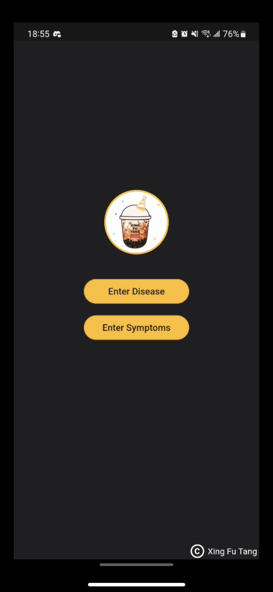
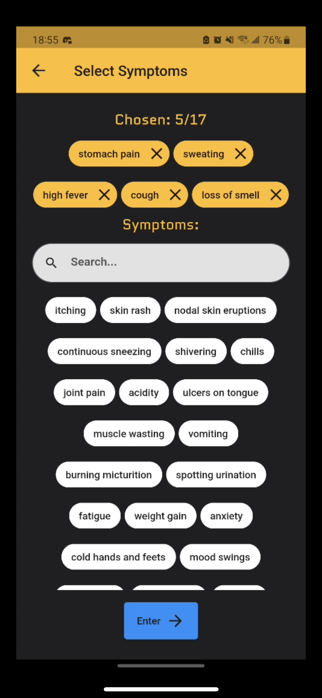
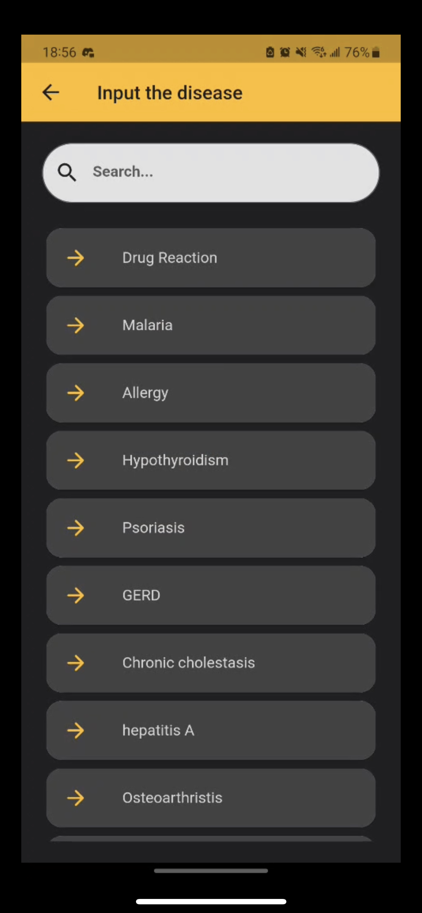
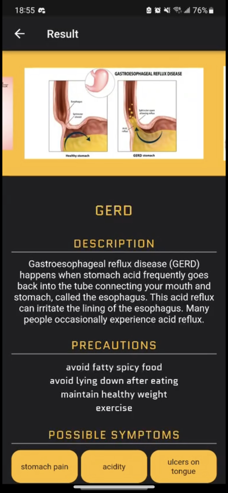

# XingFuTang
Submission for AIC compfest competition - XingFuTang team






## Table of Contents

- [Introduction](#introduction)
- [Features](#features)
- [Getting Started](#getting-started)
- [Technologies Used](#technologies-used)

## Introduction

Welcome to Xing Fu Tang, your personal health assistant! This Flutter application is designed to help users input their symptoms and receive information about possible diseases, along with descriptions and precautions.

## Features

- Input your symptoms to get information about possible diseases.
- Receive disease names, descriptions, and precautions based on input.
- User-friendly and intuitive interface.

## Run the app
The apk file is available in the apk folder.
Only android can run this apk file.

### Location
- All the codes are in first_app folder.
- The python file used to train the model is in first_app/python/model.py
- Datasets used for this project are in first_app/dataset

If you wanted to run main.dart, ensure you have met the following requirements:

- [Flutter SDK](https://flutter.dev/docs/get-started/install) installed.
- Flutter compatible IDE (e.g., [Android Studio](https://developer.android.com/studio) or [VS Code](https://code.visualstudio.com/)).

If you wanted to run the python files, the requirements can be found in first_app/python/requirements.txt

### Installation

1. Clone the repository:

   ```shell
   git clone https://github.com/yourusername/xingfutang.git
   
## Technologies Used

- Flutter: The framework used to build the mobile app.
- Dart: The programming language used for Flutter development.
- Python: The programming language used to train the model.
